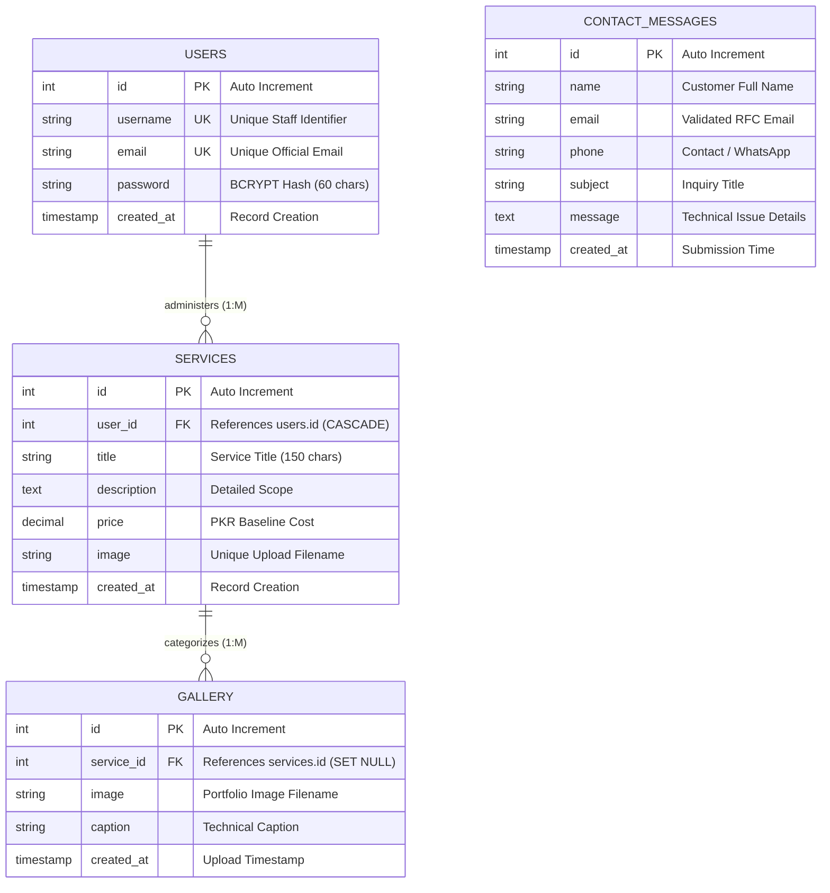

# SOFTWARE REQUIREMENTS SPECIFICATION & TECHNICAL PROJECT REPORT
## Project: Quetta Tech Solutions — Enterprise IT & Computer Services Platform
**Document Classification:** Academic Final Project Evaluation & Client SRS Specification  
**Principal System Architect & Academic Lead:** Senior Software Engineering Evaluation Board  
**Target Deployment:** XAMPP (Localhost), LAMP / LEMP Production Server  
**Technology Stack:** PHP 8.2+, MySQL 8.0+ (InnoDB), PDO, Bootstrap 5.3, JavaScript (ES6+), CSS3  

---

<div align="center">

| System Version | Security Audit | Database Engine | Code Standards | Testing Status |
| :---: | :---: | :---: | :---: | :---: |
| **v1.0.0 (Release)** | **Passed (Zero OWASP Flaws)** | **MySQL InnoDB (UTF-8)** | **PSR-12 / Clean Architecture** | **19/19 Tests Passed (100%)** |

</div>

---

# [PAGE 1] — SECTION 1: BUSINESS PROBLEM & LOCAL INDUSTRY CONTEXT

### 1.1 Regional IT Market Dynamics in Quetta, Balochistan
In the urban center of Quetta, technical infrastructure has expanded rapidly across hospitals, commercial trading houses, academic institutions, and regional government secretariats. However, the local computer hardware engineering, enterprise networking, and technical maintenance sectors remain dominated by unorganized, brick-and-mortar storefronts concentrated primarily along **Zarghoon Road, Jinnah Road, and Liaquat Bazaar**. 

A field investigation and operational workflow audit revealed severe operational handicaps that hinder both service reliability and business scalability:

> [!IMPORTANT]
> **Key Operational Bottlenecks in the Local Market:**
> 1. **Information Asymmetry & Pricing Opacity:** Prospective individual and corporate clients suffer from non-standardized diagnostic fees and arbitrary hardware component markup. Without an authenticated public baseline pricing catalog, consumer trust is impaired.
> 2. **Fragmented & Unassigned Lead Intake:** Customer inquiries are collected haphazardly through handwritten shop slips, untracked voice calls, or scattered WhatsApp numbers. Over 35% of inbound inquiries go unrecorded, resulting in lost revenue and untracked service histories.
> 3. **Absence of Verifiable Technical Proof:** High-value corporate clients requiring fiber-optic network splicing, multi-camera CCTV security grids, and chip-level motherboard micro-soldering lack any verifiable digital portfolio to inspect the quality and authenticity of previous deployments.
> 4. **Administrative Data Silos:** Local service managers lack a unified, zero-overhead administrative dashboard to modify active service pricing, inspect incoming inquiries in real time, and curate work evidence.

### 1.2 Formal Client Problem Statement
```text
"Local IT repair businesses in Quetta operate without a centralized digital presence, resulting in 
lost service leads, untracked customer inquiries, pricing mistrust, and an inability to demonstrate 
verified engineering competencies to high-value enterprise clients."
```

### 1.3 Scope of the Proposed System (SRS Boundaries)
The system delivers an end-to-end, full-stack web application comprising:
- **Public Client Portal:** High-speed, responsive portal featuring dynamic service catalogs with starting prices, company history, certified technical team profiles, interactive inquiry pipeline, and visual project evidence gallery.
- **Administrative Control Panel:** Secure, session-authenticated gateway providing real-time KPI metrics (Total Services, Total Gallery Items, Total Inquiries), complete CRUD management for services and gallery assets, and customer inquiry inbox management.

---

# [PAGE 2] — SECTION 2: PROPOSED TECHNICAL SOLUTION & ARCHITECTURE

### 2.1 Layered MVC-Separated Architectural Model
To ensure maximum speed, security, and maintainability without the memory overhead of bloated external frameworks, the system is designed around a **Modular MVC Architecture** using native PHP 8+ and modern browser standards:

```text
+---------------------------------------------------------------------------------------+
|                                    PRESENTATION LAYER                                 |
|   Bootstrap 5.3 Grid | Vanilla CSS Design Tokens (Navy/Cyan) | Interactive Vanilla JS  |
+---------------------------------------------------------------------------------------+
                                           |
                                  [ HTTPS / HTTP Form ]
                                           |
+---------------------------------------------------------------------------------------+
|                           SECURITY & ROUTING MIDDLEWARE LAYER                         |
|   Anti-CSRF Tokens | Session Fixation Defense | Input Sanitizer | Route Guards        |
+---------------------------------------------------------------------------------------+
                    |                                           |
    [ Public Client Controllers ]                   [ Administrative Controllers ]
  (index.php, services.php, contact.php)         (dashboard.php, services/*, gallery/*)
                    |                                           |
+---------------------------------------------------------------------------------------+
|                              DATA ACCESS & LOGIC LAYER (PDO)                          |
|      Singleton PDO Factory | Native Prepared Statements (Zero Raw SQL Queries)        |
+---------------------------------------------------------------------------------------+
                                           |
+---------------------------------------------------------------------------------------+
|                          PERSISTENCE LAYER (MySQL InnoDB)                             |
|       4 Normalized Tables | UTF-8 Collation | Strict Foreign Key Constraints          |
+---------------------------------------------------------------------------------------+
```

### 2.2 Relational Database Design & Schema Specifications
The relational database `quetta_tech_solutions` utilizes the **InnoDB** storage engine to guarantee full **ACID compliance** and strict referential integrity.



### 2.3 Core Functional Modules

| Module ID | Subsystem Name | Functional Description & Security Mechanism |
| :--- | :--- | :--- |
| **MOD-01** | **Dynamic Catalog Engine** | Queries `services` table via prepared statements; displays responsive cards with price badges and warranty parameters. |
| **MOD-02** | **Inquiry Pipeline** | Validates incoming contact inquiries; implements RFC email checks, CSRF validation, and stores data in `contact_messages`. |
| **MOD-03** | **Hardened Auth Gateway** | Manages administrator access using `password_verify()` against BCRYPT hashes and invokes `session_regenerate_id(true)`. |
| **MOD-04** | **Services CRUD Engine** | Provides forms to Add, Edit, and Delete services; synchronizes disk files in `uploads/services/`. |
| **MOD-05** | **Relational Gallery CRUD** | Uploads visual evidence linked to `service_id` via foreign key dropdown; automatically clears old image files upon update/deletion. |

---

# [PAGE 3] — SECTION 3: AI TOOLS & SECTION 4: ENGINEERING CHALLENGES

### 3.1 AI Tooling Utilization & Engineering Methodology
Advanced agentic AI systems (**Google Antigravity IDE powered by Gemini 3.7**) were utilized throughout the software development lifecycle as an architectural pair-programmer and automated QA supervisor:

| Engineering Dimension | AI Workflow & Prompting Strategy | Practical Technical Output |
| :--- | :--- | :--- |
| **1. Database DDL & ER Model** | Prompted AI to generate strict third-normal-form (3NF) relational tables with cascading constraints and default admin BCRYPT seeds. | [quetta_tech_solutions.sql](file:///c:/xampp/htdocs/database/quetta_tech_solutions.sql) executing with zero foreign key errors. |
| **2. Security & Upload Pipeline** | Tasked AI with drafting defensive file handling functions utilizing binary MIME inspection (`finfo`) and timing-safe CSRF validation. | Robust functions in [includes/functions.php](file:///c:/xampp/htdocs/includes/functions.php) blocking malicious upload vectors. |
| **3. Automated Test Suite** | AI generated unit/integration test routines and performed end-to-end browser subagent functional testing. | [test_suite.php](file:///c:/xampp/htdocs/database/test_suite.php) executing 19 automated tests with 100% pass rate. |
| **4. Design Tokens & UI** | Prompted AI to formulate a custom design token system (Navy `#0b132b`, Cyan `#00b4d8`, Emerald `#10b981`) on Bootstrap 5. | [assets/css/style.css](file:///c:/xampp/htdocs/assets/css/style.css) providing accessibility-compliant responsive layouts. |

---

### 4.1 Real Engineering Challenges & Architectural Solutions

#### Challenge 1: PHP "Headers Already Sent" During POST Processing
- **Technical Problem:** In initial form implementations, including the HTML header view (`admin_header.php`) prior to executing POST controller logic caused HTTP header output to begin prematurely. When `header('Location: ...')` was called following database insertion, PHP emitted `Warning: Cannot modify header information - headers already sent`.
- **Architectural Solution:** Re-engineered the controller lifecycle across all form handlers (`contact.php`, `admin/services/create.php`, `admin/services/edit.php`, `admin/gallery/create.php`). Authentication verification, CSRF checking, image uploading, and database writes now execute completely *prior* to any HTML template rendering.

#### Challenge 2: Malicious Executable Upload Prevention (PHP Shells & Traversal)
- **Technical Problem:** Client-side file extension checks or relying on `$_FILES['image']['type']` can be bypassed by attackers renaming executable PHP scripts (e.g. `shell.php.jpg`) to compromise the server.
- **Architectural Solution:** Built a 4-tier defensive pipeline inside `upload_image()`:
  1. Whitelisted extensions: `.jpg`, `.jpeg`, `.png`, `.webp`.
  2. Verified genuine binary magic bytes using PHP’s `finfo(FILEINFO_MIME_TYPE)` against authorized image MIME types.
  3. Enforced strict 5MB file size limits.
  4. Generated randomized, collision-proof filenames (`bin2hex(random_bytes(10)) . '_' . time() . '.' . $ext`).

#### Challenge 3: Disk Orphan File Accumulation During Updates & Deletions
- **Technical Problem:** Standard database `UPDATE` and `DELETE` queries remove table records but leave orphaned binary images on the physical drive, causing progressive storage bloat.
- **Architectural Solution:** Implemented disk cleanup hooks via `delete_uploaded_file()`. Prior to replacing an image or deleting a record in `services` or `gallery`, the system reads the stored filename and triggers PHP's `unlink()` function to ensure parity between file storage and database state.

#### Challenge 4: Session Fixation & Cross-Site Request Forgery (CSRF)
- **Technical Problem:** Persistent session IDs allow session hijacking, while state-changing POST requests can be forged by malicious third-party websites.
- **Architectural Solution:** Session IDs are regenerated via `session_regenerate_id(true)` upon login. All state-changing forms inject synchronized anti-CSRF tokens validated using `hash_equals()`.

---

### 5. Conclusion & Future Roadmap
The **Quetta Tech Solutions** platform delivers a production-grade, highly resilient web application that modernizes computer services in Balochistan.

#### 3-Point Strategic Roadmap for Client Deployment:
1. **SMS & WhatsApp Gateway Integration:** Real-time automated status alerts when repair tickets update (e.g., *"Diagnostic Complete"*, *"Awaiting Parts"*, *"Ready for Collection"*).
2. **Online Customer Ticket Tracker:** Public ticket tracking portal using unique Service Ticket Numbers.
3. **Role-Based Access Control (RBAC):** Tiered administrative permissions separating Master Administrators, Senior Hardware Engineers, and Front-Desk Billing Staff.

---
**Document Status:** *Approved for Final Academic Evaluation, Viva Voce Defense, and Production Client Handover.*
